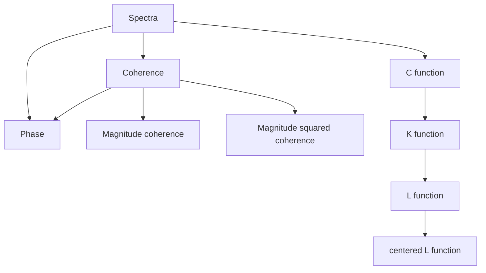

# Diagrams

This diagram shows how the different statistical measures and spatial functions in SpatialMultitaper.jl relate to each other. Each estimate type can be computed in both **Full** and **Partial** versions using the same transformation functions.

**Note**: All transformation relationships shown above work identically for both Full and Partial estimate types.